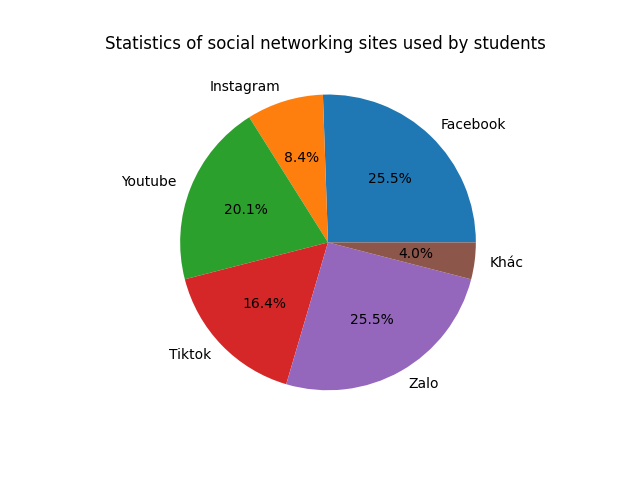

<!DOCTYPE html>
<html>
<head>
  <title> Statistics of social networking sites used by students</title>
Figure_1.png
  <ul>
    <li>Item 1</li>
    <li>Item 2</li>
    <li>Item 3</li>
  </ul>
  
  
  
  <a href="https://www.example.com">Visit Example.com</a>
</body>
</html>
